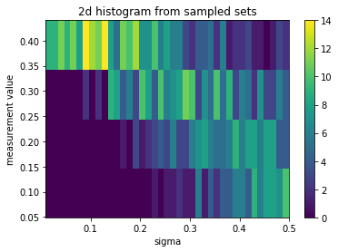

# Sampling of Biased Physical Signals

## Overview

1. Introduction
2. Random sampling
3. Signal optimization
4. Balanced sampling

# 1. Introduction

The goal here is to develop a method for sampling physical signals that are inherently strongly biased. More specifically, we deal with cases in which a system responds to random inputs by outputing mostly minimum signals. Under these circumstances randomly sampling the inputs would result in a highly unbalanced dataset. Such a situation may result in a drastic reduction on the performance of machine learning classifiers or regressors trained on the data.

We illustrate the developed algorithms on a concrete example: the simulated response of a multilevel quantum system after interacting with a shaped ultrafast laser. The system inputs correspond to the laser pulse shape parameters, and randomly sampling the inputs resuls overwhelmingly on low-valued signals, as it will be seen below.

It is not necesary to understand all the concepts given below to understand the sampling technique described here (section 4). In particular, the information about the laser and quantum system below (i.e., in the rest of this introductory section) is given only as a reference and can be skipped. We define next details for the calculation of the physical simulated signal we will be using to illustrate the sampling technique.

## 1.1 System definition


```python
%matplotlib inline
import numpy as np
import pandas as pd
import matplotlib.pyplot as plt
import seaborn as sns

from ultsims import QSolve, Field
import copy
import numpy as np
from scipy.interpolate import interp1d 
```

### Laser field specification


```python
spec = Field.get_spectrum(
    center_wavelength=790,
    fwhm=40,
    lambda_min=740,
    lambda_max=860,
    dlambda = 0.1
)
etl = Field.Elambda_from_spectrum(
    spec,
    fluence=3.2e-4
) # power=300mW, rep. rate=3KHz, diameter=1cm, 20% loss through cell window
```

### Quantum system specification

A five-level quantum system with Hamiltonian H = Ho + $\mu$E(t), where Ho is the unexcited Hamiltonian, $\mu$ is the dipole moment and E(t) is the laser field. The system energy levels and dipoles attempt to imitate the lowest valence levels of atomic Rubidium.


```python
Ho = np.diag([0, # 5s
              1240 / 794.7603, # 5p1/2 
              1240 / 780.0268, # 5p3/2
              1240 / 780.0268 + 1240 / 775.94363, # 5d3/2
              1240 / 780.0268 + 1240 / 775.76507, # 5d5/2
             ])
mu = [[0.000, 2.232, 3.157, 0.000, 0.000], 
      [2.232, 0.000, 0.000, 0.856, 0.000],
      [3.157, 0.000, 0.000, 0.401, 1.237],
      [0.000, 0.856, 0.401, 0.000, 0.000],
      [0.000, 0.000, 1.237, 0.000, 0.000],
     ]
```

## 1.2 Laser pulse shaping

The laser is shaped by modifying its spectral phases grouped in 640 pixels. The now shaped field is then transformed to the time domain E(t) for calculating its interaction with the quantum system.


```python
phases = 2 * np.pi * np.random.rand(640)
    
elambda = etl.copy()
slm_mask = Field.construct_slm_mask(
    phases, 
    central_wavelength=800, 
    pix2nm=0.2, npixels=640
)
elambda = Field.shape_Elambda(elambda, slm_mask)
et = Field.Et_from_Elambda(elambda)

Field.plot_field(slm_mask)
Field.plot_field(elambda)
Field.plot_field(et)
```


The "phases" above constitute our controlling inputs with which the shape of the laser can be manipulated, resulting in a large variety of possible fields E(t). Roughly, experimentaly it is possible to produce ~100$^{640}$ = 10$^{1280}$ distinct pulse shapes by only modifying the spectral phase. This capability of producing a large number of potential samples makes pulse shaping attractive for machine learning applications.

## 1.3 Laser-quantum system interaction


```python
et_complex = et.amplitudes.values * np.exp(1j * et.phases.values)
teval = et.t.values
psi_i = [1, 0, 0, 0, 0]

u = QSolve.main(
    Ho, mu, et_complex, 
    et.t.values, et.wo.values[0],
    teval, 'multilevel'
)
psi = QSolve.calculate_psi(u, psi_i)
QSolve.plot_populations(teval, psi)
```


Here are changes in the five quantum state populations as a response to the random laser field.

# 2 Random sampling

The system can be sampled by generating random phases in the [0, 2$\pi$] interval. Below, the final population in state $|3\rangle$ is recoded as signal. To be consistent with later calculations, will start bundling the phase in groups of 4 contiguous pixels.

## 2.1 Signal function


```python
def signal_function(phase=np.zeros(160)):
    ph = np.repeat(phase, 4)
    elambda = etl.copy()
    slm_mask = Field.construct_slm_mask(
        ph, 
        central_wavelength=800, 
        pix2nm=0.2, npixels=640
    )
    elambda = Field.shape_Elambda(elambda, slm_mask)
    et = Field.Et_from_Elambda(elambda)

    et_complex = et.amplitudes.values * np.exp(1j * et.phases.values)
    teval = et.t.values
    psi_i = [1, 0, 0, 0, 0]

    u = QSolve.main(
        Ho, mu, et_complex, 
        et.t.values, et.wo.values[0],
        teval, 'multilevel'
    )
    psi = QSolve.calculate_psi(u, psi_i)
    
    return np.abs(psi[-1, 3]) ** 2

print signal_function()
```

    0.03946705790727739


## 2.2 Random sampling


```python
from tqdm import tqdm

np.random.seed(4)

signals = []
indices = []

for k in tqdm(range(1000)):
    phase = 2 * np.pi * np.random.rand(160)
    signals.append(signal_function(phase))
    indices.append(k)

signals_df = pd.DataFrame({"sample number": indices, "signals": signals})
plt.figure("plot")
signals_df.plot(x="sample number", y="signals", title="random sampling")
plt.figure("hist")
signals_df["signals"].hist()
plt.xlabel("signal") 
plt.ylabel("occurrences")
```

    100%|██████████| 1000/1000 [01:49<00:00,  9.13it/s]


    Text(0,0.5,'occurrences')


    <Figure size 432x288 with 0 Axes>


As it can be seen, random sampling the phases produces a dataset strongly biased towards low-value signals. As shown below, the performance of random sampling is even worse than it seems since the signal ranges all the way up to ~0.5. To see this we will perform an input optimization.

# 3 Signal optimization

While developing any sampling procedure it is important to know the signal range. In this particular system, the minimum signal is equal to zero (i.e., the population of state $|3\rangle$ cannot be less than zero). From the random sampling above we see that the minimum signal can be obtained by a large set of (randomly chosen) inputs. To find the (yet unknown) limit at the other end, we will run a signal optimization.

The optimization will be performed by a genetic algorithm (GA) which will attempt to maximize the signal function defined above.

## 3.1 Fitness function

The fitness function just wraps the signal function to include graphing and saving procedures that are called by the GA.


```python
def fitness(X=np.zeros(160), graph=False, save_in=''):
    J = signal_function(X)
    
    # the GA below looks for the following
    # for plotting and saving
    if graph:
        Field.plot_field(slm_mask)
        Field.plot_field(elambda)
        Field.plot_field(et)
#         QSolve.plot_u(teval, u)
        psi = QSolve.calculate_psi(u, psi_i)
        QSolve.plot_populations(teval, psi)
        print 'signal: {}'.format(J)
    
    if save_in:
        slm_mask.to_csv(save_in, index=False)
    
    return J

print fitness()
```

    0.03946705790727739


## 3.2 Run a GA signal optimization


```python
from ga import ga
import os


# open the gui:
os.system("python ga/gui.py &")

ga_engine = ga.main(
    fitness_function=fitness, 
    population_size=80,
    parameters_per_individual=160,
    parameter_bounds=(0, 2 * np.pi),
    mutation_rate= 0.02,
    crossover_rate=0.8,
    freq_stats=1000,
    max_gens=10000
)
ga.save('data/optimum_signal.csv', 
        ga_engine, fitness)
ga.plotBest(ga_engine)
ga.plotFitnessHistory()
```

maximum at ~0.5

# 4. Balanced sampling

### Brief description:

The balanced sampling technique we propose involves the following steps:
1. **Obtain** a set of inputs **x$_0$** corresponding to a signal **optimum**.
2. **Sample away from x$_0$ by adding to it perturbations**. The perturbations are generated from a set of normal distributions corresponding to a pre-selected **set of $\sigma$'s**. The logic here is that since x$_0$ corresponds to an optimum signal, going away from x$_0$ will result in lower signals. Also, since, as shown above, random x corresponds here to the lowest signals, perturbating far enough from x$_0$ would go all the way to minimum signal. At the end of this step we have sets of samples, each corresponding to a $\sigma$ value.
3. **Map each $\sigma$ to a distribution over the signal y** by calculating the histogram in each set. The resulting matrix (i.e., rows and columns corresponding to $\sigma$'s and y's, respectively) is then up-sampled by a smooth interpolation. The result at this point is approximately similar to having measured for many more $\sigma$ sets and for many more points in each set (i.e., more ponts would allow for much finer histograms).
4. **Obtain and optimum set of weights** (i.e., one weight per sigma value) that allow obtaining a balanced dataset in the signal y. The weights are found through approximately inverting the $\sigma$'s-y's matrix with the aid of a genetic algorithm (GA).
5. **Sample a balanced dataset using the weights**. This is done for each sample by generating its inputs from a normal distribution with a $\sigma$ chosen by a weighted ramdom draw.


```python
%matplotlib inline
import numpy as np
import pandas as pd
import matplotlib.pyplot as plt
import seaborn as sns

from ultsims import Field, QSolve
import sampling
```

## 4.1 Load the optimum inputs x0

### Load and transform the optimum inputs

Will load the optimum inputs x$_0$ found above. After that will switch the inputs from a phase representation to the real and imaginary parts of a unitary amplitude complex exponential. As a result the input shape goes from (160,) to (160, 2). Unlike a phase (which can take values from -$\infty$ to +$\infty$), the transformed array has bounded values (in the [-1, 1] interval) making it easier to sample.


```python
x0 = np.loadtxt("data/optimum_signal__parameters.txt")
x0 = np.exp(1j * x0)
x0 = np.array([x0.real, x0.imag]).T
print x0.shape
print x0[:3, :3]
```

    (160, 2)
    [[-0.99350173 -0.11381702]
     [ 1.          0.        ]
     [ 0.76589534 -0.64296526]]


### Redefine the signal inputs

The signal function needs to now accept two columns of real and imaginary parts instead of a 1D phase array.


```python
spec = Field.get_spectrum(
    center_wavelength=790,
    fwhm=40,
    lambda_min=740,
    lambda_max=860,
    dlambda = 0.1
)
etl = Field.Elambda_from_spectrum(
    spec,
    fluence=3.2e-4
) # power=300mW, rep. rate=3KHz, diameter=1cm, 20% loss through cell window

Ho = np.diag([0, # 5s
              1240 / 794.7603, # 5p1/2 
              1240 / 780.0268, # 5p3/2
              1240 / 780.0268 + 1240 / 775.94363, # 5d3/2
              1240 / 780.0268 + 1240 / 775.76507, # 5d5/2
             ])
mu = [[0.000, 2.232, 3.157, 0.000, 0.000], 
      [2.232, 0.000, 0.000, 0.856, 0.000],
      [3.157, 0.000, 0.000, 0.401, 1.237],
      [0.000, 0.856, 0.401, 0.000, 0.000],
      [0.000, 0.000, 1.237, 0.000, 0.000],
     ]


def signal_function(x=np.zeros((160, 2))):
    xcomplex = x[:, 0] + 1j * x[:, 1]
    xcomplex = np.repeat(xcomplex, 4)
    ph = np.angle(xcomplex)
    amp = np.abs(xcomplex)
    elambda = etl.copy()
    slm_mask = Field.construct_slm_mask(
        phases=ph, 
        amplitudes=amp, 
        central_wavelength=800, 
        pix2nm=0.2, npixels=640
    )
    elambda = Field.shape_Elambda(elambda, slm_mask)
    et = Field.Et_from_Elambda(elambda)

    et_complex = et.amplitudes.values * np.exp(1j * et.phases.values)
    teval = et.t.values
    psi_i = [1, 0, 0, 0, 0]

    u = QSolve.main(
        Ho, mu, et_complex, 
        et.t.values, et.wo.values[0],
        teval, 'multilevel'
    )
    psi = QSolve.calculate_psi(u, psi_i)
    
    return np.abs(psi[-1, 3]) ** 2

print "the optimum signal is {}".format(signal_function(x0))
```

    the optimum signal is 0.490909148514


## 4.2 Sampling with a set of sigmas

With x0 at hand, it is possible to sample the signal by progressively perturbating away from x0. We know that x0 corresponds to maximum signal, so small perturbations away from x0 would still correspond to high signals. On the other hand, we know that randomly sampling the inputs results in signals close to zero. Thus, by perturbating strongly enough away from x0, it is possible to reach the minimum signals. Therefore, inputs calculated from x0 by addint to it a range of perturbations ranging from small to large may be able to sample the signal thorought its range from maximum to minimum.

The function below finds the signas corresponding to inputs x = x0 + perturbations. Where, the perturbations are calculated from 40 normal distributions each corresponding to one value of $\sigma$ in [0.01, 0.022, ..., 0.487, 0.5]. For each value of $\sigma$ 20 samples are taken. Thus, the sampling below produces 800 signals.

The maximum $\sigma$ of 0.5 was chosen considering that here the inputs are bounded between -1 and 1. Larger $\sigma$'s would stray more often away from the [-1, 1] interval. In a more general case, both the maximum and minimum $\sigma$'s can be changed and tried to obtain good coverage of the signal values.


```python
sampled_sets = sampling.uniformSigmasSampling(
        signal_function=signal_function,
        Xo=x0,
        sigma_min=0.01,
        sigma_max=0.5,
        nsigmas=40,
        nsamples=20,
        graph=True,
        save_in="data/data_sampling.h5")
```


    <Figure size 432x288 with 0 Axes>


    (40,)


    /usr/lib/python2.7/dist-packages/pandas/core/generic.py:939: PerformanceWarning: 
    your performance may suffer as PyTables will pickle object types that it cannot
    map directly to c-types [inferred_type->mixed,key->block1_values] [items->['X', 'measurements']]
    
      return pytables.to_hdf(path_or_buf, key, self, **kwargs)


We can see that no single $\sigma$ perturbation is able to sample the whole range of signals. On the other hand, a composite sampling approach like the above with groups of perturbations defined by the $\sigma$'s can sample the range of signals. Indedd, by simply sampling away from the maximum with uniformly-distributed increasing $\sigma$'s, an already reasonably balanced dataset (compared with fully random sampling) is obtained.

In some cases the above sampling may already give reasonably good results. In other cases that may not be the case. For instance, in highly nonlinear systems the signal can quickly decay as a function of perturbation strenght. The remaining steps aim at leveraging the information obtained above to produce a more robust sampling procedure.

## 4.2 Expected signals to sigmas map

The signal sets obtained by the various $\sigma$'s above can be processed to obtain a distribution map of expected signals for each $\sigma$ value.


```python
sigmas, ycenters, hist2d = sampling.histogramFromSampledSets(
        sampled_sets=sampled_sets,
        nbins=5, graph=True,
        save_in="data/data_sampling.h5")
```





This mapping is critical to the sampling procedure: it allows obtaining a balanced dataset by selecting a group of $\sigma$'s that would produce, in turn, well distributed signals. Below, this 'selecting' is done by a genetic algorithm (GA) through assigning weights to the $\sigma$'s. But before that, the rough map above has to be up-sampled to feed the GA more fine-grained information.

### Up-sample the map


```python
new_sigmas, new_ycenters, new_2dhist = sampling.interpolateHistogram(
        sigmas=sigmas,
        ycenters=ycenters,
        histogram2d=hist2d,
        sigma_nbins=100,
        y_nbins=100,
        graph=True,
        save_in="data/data_sampling.h5")
```


## 4.3 Get optimum sampling weights

Suppose that a large number of points is sampled. Each sample corresponds to inputs given by x = x0 + $\mathcal{N}(0, \sigma)$, where $\mathcal{N}(0, \sigma)$ corresponds to a normal distribution centered at zero and standard deviation given by $\sigma$. Now, suppose that we perform the above samples by measuring $W_1$ points with $\sigma_1$, $W_2$ points with $\sigma_2$, etc. If the $(n_{rows}, n_{cols})$ up-sampled matrix above is denoted by M(y, $\sigma$), the expected sampled signals will be given by:

$b = M(y, \sigma) \times W$

where, $b = [n_{y_1}, n_{y_2}, \ldots, n_{y_{n_{rows}}}]$ denotes a vector whose elements indicate the expected number $n_{y_i}$ of sampled signals with values within a signal bin around $y_i$, $\times$ denotes matrix multiplication, and $W = [W_1, W_2, ..., W_{n_{cols}}]$.

The elements of $W$ are for now on refered to as weights. To obtain a balanced dataset, a genetic algorithm (GA) tries to obtain a set of weights that minimize the following fitness:

$J = ||\mathbb{1} - M(y, \sigma) \times W||$

where, $\mathbb{1} = [1, 1, ..., 1]$, and $||v||$ denotes the norm of vector $v$. Thus, below the GA's objective is to find a set of weights $W$ that produces a perfectly balanced dataset. Notice that since $b=[1, 1, ..., 1]$ the elements of $W$ will be floats instead of integers, but this does not affect the calculations, and the obtained $W$ can be understood as the relative weights for sampling a balanced dataset using the selected $\sigma$'s.


```python
weights = sampling.sigmaWeightsForUniformYSampling(
        hist2d=new_2dhist,
        fitness_exponent=2,
        population_size=500,
        parameters_per_individual=100,
        parameter_bounds=(0.01, 0.5),
        mutation_rate=0.02,
        crossover_rate=0.8,
        freq_stats=200,
        max_gens=1000,
        graph=True,
        save_in="data/data_sampling.h5")
```

    Gen. 0 (0.00%): Max/Min/Avg Fitness(Raw) [0.09(0.13)/0.00(0.03)/0.03(0.07)]
    Gen. 200 (20.00%): Max/Min/Avg Fitness(Raw) [0.00(0.00)/0.00(0.00)/0.00(0.00)]
    Gen. 400 (40.00%): Max/Min/Avg Fitness(Raw) [0.00(0.01)/0.00(0.00)/0.00(0.00)]
    Gen. 600 (60.00%): Max/Min/Avg Fitness(Raw) [0.00(0.01)/0.00(0.00)/0.00(0.00)]
    Gen. 800 (80.00%): Max/Min/Avg Fitness(Raw) [0.00(0.01)/0.00(0.00)/0.00(0.00)]
    Gen. 1000 (100.00%): Max/Min/Avg Fitness(Raw) [0.00(0.01)/0.00(0.00)/0.00(0.00)]
    Total time elapsed: 128.448 seconds.


The optimum weights produce an expected dataset approximately balanced.

## 4.4 Using the weights for sampling a balanced dataset


```python
X, ysampled = sampling.weightedSigmasSampling(
    npoints=100000,
    sigmas=new_sigmas,
    weights=weights,
    signal_function=signal_function,
    Xo=x0,
    graph=True,
    Xseeds_only=True,
    save_in="data/data_sampling.h5",
)
```

    100%|██████████| 100000/100000 [2:45:30<00:00, 10.07it/s] 


The signals sampled with the optimum weights are not as near-perfectly balanced as expected above, but they constitute a relatively well balanced dataset suitable to machine learning applications. Notice that the procedure above did not necesitate any internal information about the system. The steps above can be replicated with any signal function, the main requirement is that the signal can be optimized by the GA.
