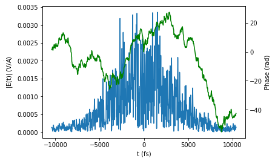
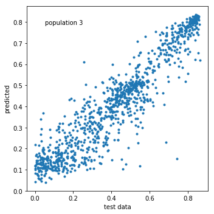

# Sampling of Biased Physical Signals

## Overview

1. Introduction
2. Random sampling
3. Signal optimization
4. Balanced sampling
5. Building predictive models with the sampled data
6. Conclusions

# 1. Introduction

The goal here is to develop a method for sampling physical signals that are inherently strongly biased. More specifically, we deal with cases in which a system responds to random inputs by outputing mostly minimum signals. Under these circumstances randomly sampling the inputs would yield a highly unbalanced dataset. Such a situation may result in a drastic performance reduction of machine learning classifiers or regressors trained on the data.

We illustrate the developed algorithms on a concrete example: the simulated response of a multilevel quantum system interacting with a shaped ultrafast laser. The system inputs correspond to the laser pulse shape parameters. Randomly sampling the inputs overwhelmingly resuls in low-valued signals. Thus the need here for a more sophisticated sampling method.

It is not required to understand all the particular details about the system to understand the sampling technique described here (section 4). More specifically, the information about the laser and quantum system (i.e., in the rest of this introductory section) is given only as a reference and can be skipped. 

We next specify a function for the physical simulated signal that we will be using to illustrate the sampling technique.


```python
%matplotlib inline
import numpy as np
import pandas as pd
import matplotlib.pyplot as plt
import seaborn as sns

from ultsims import QSolve, Field
import copy
import numpy as np
from scipy.interpolate import interp1d 
```

## 1.1 System definition

### Laser field specification


```python
spec = Field.get_spectrum(
    center_wavelength=790,
    fwhm=40,
    lambda_min=740,
    lambda_max=860,
    dlambda = 0.1
)
etl = Field.Elambda_from_spectrum(
    spec,
    fluence=1e-3, # J / cm ^ 2
) # power=937.5mW, rep. rate=3KHz, diameter=1cm, 20% loss through cell window
```

### Quantum system specification

A five-level quantum system with Hamiltonian H = Ho + $\mu$E(t), where Ho is the field-free Hamiltonian, $\mu$ is the dipole moment and E(t) is the laser field. The chosen energy levels and dipoles are intended to roughly simulate the lowest valence levels of atomic Rubidium.


```python
Ho = np.diag([0, # 5s
              1240 / 794.7603, # 5p1/2 
              1240 / 780.0268, # 5p3/2
              1240 / 780.0268 + 1240 / 775.94363, # 5d3/2
              1240 / 780.0268 + 1240 / 775.76507, # 5d5/2
             ])
mu = [[0.000, 2.232, 3.157, 0.000, 0.000], 
      [2.232, 0.000, 0.000, 0.856, 0.000],
      [3.157, 0.000, 0.000, 0.401, 1.237],
      [0.000, 0.856, 0.401, 0.000, 0.000],
      [0.000, 0.000, 1.237, 0.000, 0.000],
     ]
```

## 1.2 Laser pulse shaping

The laser is shaped by modifying its spectral phases at 640 narrow spectral intervals (pixels). The thus shaped field is then transformed to the time domain E(t) for calculating its interaction with the quantum system.


```python
phases = 2 * np.pi * np.random.rand(640)
    
elambda = etl.copy()
slm_mask = Field.construct_slm_mask(
    phases, 
    central_wavelength=800, 
    pix2nm=0.2, npixels=640
)
elambda = Field.shape_Elambda(elambda, slm_mask)
et = Field.Et_from_Elambda(elambda)

Field.plot_field(slm_mask)
Field.plot_field(elambda)
Field.plot_field(et)
```





The pixel phases above constitute our controlling inputs. This results in an enormous variety of possible fields E(t). Roughly, it is possible to produce ~100$^{640}$ = 10$^{1280}$ distinct pulse shapes by only modifying the spectral phases. The potential for automatically producing a large number of labeled samples makes pulse shaping attractive for machine learning applications.

## 1.3 Laser-quantum system interaction


```python
et_complex = et.amplitudes.values * np.exp(1j * et.phases.values)
teval = et.t.values
psi_i = [1, 0, 0, 0, 0]

u = QSolve.main(
    Ho, mu, et_complex, 
    et.t.values, et.wo.values[0],
    teval, 'multilevel'
)
psi = QSolve.calculate_psi(u, psi_i)
QSolve.plot_populations(teval, psi)
```


Here are the time-resolved changes in the five quantum state populations as a response to the random laser field.

# 2 Random sampling

The system can be sampled by generating random phases in the [0, 2$\pi$] interval. The final population in state $|3\rangle$ is taken as signal. To be consistent with later calculations, we will start bundling the phase in groups of 10 contiguous pixels.

## 2.1 Signal function


```python
def signal_function(phase=np.zeros(64)):
    nbundling = int(np.ceil(640. / np.size(phase)))
    ph = np.repeat(phase, nbundling)[:640]
    elambda = etl.copy()
    slm_mask = Field.construct_slm_mask(
        ph, 
        central_wavelength=800, 
        pix2nm=0.2, npixels=640
    )
    elambda = Field.shape_Elambda(elambda, slm_mask)
    et = Field.Et_from_Elambda(elambda)

    et_complex = et.amplitudes.values * np.exp(1j * et.phases.values)
    teval = et.t.values
    psi_i = [1, 0, 0, 0, 0]

    u = QSolve.main(
        Ho, mu, et_complex, 
        et.t.values, et.wo.values[0],
        teval, 'multilevel'
    )
    psi = QSolve.calculate_psi(u, psi_i)
    
    return np.abs(psi[-1, 3]) ** 2

print signal_function()
```

    0.0338622752558309


## 2.2 Random sampling


```python
from tqdm import tqdm

np.random.seed(10)

signals = []
indices = []

for k in tqdm(range(1000)):
    phase = 2 * np.pi * np.random.rand(64)
    signals.append(signal_function(phase))
    indices.append(k)

signals_df = pd.DataFrame({"sample number": indices, "signals": signals})
plt.figure("plot")
signals_df.plot(x="sample number", y="signals", title="random sampling")
plt.figure("hist")
signals_df["signals"].hist()
plt.xlabel("signal") 
plt.ylabel("occurrences")
```

    100%|██████████| 1000/1000 [01:58<00:00,  8.47it/s]


    Text(0,0.5,'occurrences')


    <Figure size 432x288 with 0 Axes>


As it can be seen, random sampling the phases produces a dataset strongly biased towards low-valued signals. As shown below, the performance of random sampling is even worse than it seems from the histogram above. The signal values extend all the way to ~0.9. To see this we will perform an optimization.

# 3 Signal optimization

While developing any sampling procedure it is important to know the signal range. In this particular system, the minimum signal is equal to zero (i.e., the population of state $|3\rangle$ cannot be less than zero). From the results shown above we see that signals close to the minimum can be obtained through random sampling. To find the (yet unknown) limit at the higher signal end we will run a signal optimization.

The signal optimization will be performed by a genetic algorithm (GA).

## 3.1 Fitness function

The GA fitness function wraps the signal function defined above to include graphing and saving procedures that are optionally called by the GA. A 'complexity' penalty is also added to the fitness. The penalty consists in reducing the fitness by a small amount depending on how much the inputs change (i.e., the penalty is proportional to the input derivative). The chosen form for the penalty will tend to smooth the phase inputs for non-relevant pixels.


```python
def fitness(X=np.zeros(64), graph=False, save_in=''):
    J = float(signal_function(X))
    # penalize complexity:
    J *= (1 - 0.05 * np.mean(np.abs(np.diff(np.unwrap(X) / (2 * np.pi)))))
#     J *= (1 - 0.05 * np.mean(X))
    
    # the GA below looks for the following
    # for plotting and saving
    if graph:
        Field.plot_field(slm_mask)
        Field.plot_field(elambda)
        Field.plot_field(et)
#         QSolve.plot_u(teval, u)
        psi = QSolve.calculate_psi(u, psi_i)
        QSolve.plot_populations(teval, psi)
        print 'signal: {}'.format(J)
    
    if save_in:
        slm_mask.to_csv(save_in, index=False)
    
    return J

print fitness()
```

    0.0338622752558309


## 3.2 Run a GA signal optimization

Will run a GA optimization for a large number of generations so that the reduction of complexity term in the fitness function (see above) may have a chance at simplifying the optimum phase where possible.


```python
from ga import ga
import os


# open the gui:
os.system("python ga/gui.py &")

ga_engine = ga.main(
    fitness_function=fitness, 
    population_size=80,
    parameters_per_individual=64, # bundling = 10
    parameter_bounds=(0, 2 * np.pi),
    mutation_rate= 0.02,
    crossover_rate=0.8,
    freq_stats=1000,
    max_gens=10000,
)
ga.save('data/optimum_signal.csv', 
        ga_engine, fitness)
# ga.plotBest(ga_engine)
ga.plotFitnessHistory()
```

    Gen. 0 (0.00%): Max/Min/Avg Fitness(Raw) [0.33(0.28)/0.05(0.00)/0.12(0.07)]
    Gen. 1000 (10.00%): Max/Min/Avg Fitness(Raw) [0.21(0.76)/0.00(0.26)/0.18(0.73)]
    Gen. 2000 (20.00%): Max/Min/Avg Fitness(Raw) [0.29(0.76)/0.00(0.07)/0.26(0.72)]
    Gen. 3000 (30.00%): Max/Min/Avg Fitness(Raw) [0.36(0.78)/0.00(0.17)/0.31(0.71)]
    Gen. 4000 (40.00%): Max/Min/Avg Fitness(Raw) [0.37(0.83)/0.00(0.09)/0.32(0.76)]
    Gen. 5000 (50.00%): Max/Min/Avg Fitness(Raw) [0.29(0.84)/0.00(0.18)/0.25(0.79)]
    Gen. 6000 (60.00%): Max/Min/Avg Fitness(Raw) [0.24(0.84)/0.00(0.37)/0.21(0.80)]
    Gen. 7000 (70.00%): Max/Min/Avg Fitness(Raw) [0.33(0.84)/0.00(0.17)/0.29(0.79)]
    Gen. 8000 (80.00%): Max/Min/Avg Fitness(Raw) [0.37(0.85)/0.00(0.14)/0.32(0.79)]
    Gen. 9000 (90.00%): Max/Min/Avg Fitness(Raw) [0.25(0.85)/0.00(0.35)/0.22(0.81)]
    
    	Evolution stopped by Termination Criteria function !
    
    Gen. 9255 (92.55%): Max/Min/Avg Fitness(Raw) [0.23(0.85)/0.00(0.35)/0.20(0.81)]
    Total time elapsed: 82986.384 seconds.
    fitness history saved to "data/optimum_signal__fitness_history.csv"
    best parameters saved to "data/optimum_signal__parameters.txt"
    best parameters translated by "<function fitness at 0x7f3f740ffaa0>" saved to "data/optimum_signal__best.csv"


Maximum population at ~0.9. The fitness value is lower because of the complexity penalty term.

# 4. Balanced sampling

### Brief description:

The balanced sampling technique we propose involves the following steps:

1. **Obtain** a set of inputs **x$_0$** corresponding to a signal **optimum**.

2. **Sample away from x$_0$ by adding to it perturbations**. The perturbations are generated from a set of normal distributions corresponding to a pre-selected **set of $\sigma$'s**. The logic here is that since x$_0$ corresponds to an optimum signal, going away from x$_0$ will result in lower signals. Also, since, as shown above, random x corresponds here to the lowest signals, perturbating far enough from x$_0$ would go all the way to minimum signal. At the end of this step we have sets of samples, each corresponding to a $\sigma$ value.

3. **Map each $\sigma$ to a distribution over the signal y** by calculating the histogram in each set. The resulting matrix (i.e., rows and columns corresponding to $\sigma$'s and y's, respectively) is then up-sampled by a smooth interpolation.

4. **Obtain and optimum set of weights** (i.e., one weight per sigma value) that allow obtaining a balanced dataset in the signal y. The weights are found through approximately inverting the $\sigma$'s-y's matrix (i.e., the map obtained in step 3 above) with the aid of a genetic algorithm (GA).

5. **Sample a balanced dataset using the weights**. This is done for each sample by generating its inputs from a normal distribution with a $\sigma$ chosen by a weighted random draw.

We describe the various steps in more detail below.


```python
%matplotlib inline
import numpy as np
import pandas as pd
import matplotlib.pyplot as plt
import seaborn as sns

from ultsims import Field, QSolve
import sampling
```

## 4.1 Load the optimum inputs x0

### Load and transform the optimum inputs

Will load the optimum inputs x$_0$ found above. After that will switch the inputs from a phase representation to the real and imaginary parts of a unitary complex exponential. This transformation is simply another valid representation of the physical mask used during laser pulse shaping. As a result the input shape goes from (64,) to (64, 2). Unlike a phase (which can take values from -$\infty$ to +$\infty$), the transformed array has bounded values (in the [-1, 1] interval) making it easier to sample.


```python
x0 = np.loadtxt("data/optimum_signal__parameters.txt")
x0 = np.exp(1j * x0)
x0 = np.array([x0.real, x0.imag]).T
print x0.shape
print x0[:3, :3]
```

    (64, 2)
    [[ 1.0000000e+00 -2.4492936e-16]
     [ 1.0000000e+00 -2.4492936e-16]
     [ 1.0000000e+00 -2.4492936e-16]]


### Redefine the signal inputs

The signal function needs to now accept two columns of real and imaginary parts in place of the previous 1D phase input.


```python
spec = Field.get_spectrum(
    center_wavelength=790,
    fwhm=40,
    lambda_min=740,
    lambda_max=860,
    dlambda = 0.1
)
etl = Field.Elambda_from_spectrum(
    spec,
    fluence=1e-3,
) # power=300mW, rep. rate=3KHz, diameter=1cm, 20% loss through cell window

Ho = np.diag([0, # 5s
              1240 / 794.7603, # 5p1/2 
              1240 / 780.0268, # 5p3/2
              1240 / 780.0268 + 1240 / 775.94363, # 5d3/2
              1240 / 780.0268 + 1240 / 775.76507, # 5d5/2
             ])
mu = [[0.000, 2.232, 3.157, 0.000, 0.000], 
      [2.232, 0.000, 0.000, 0.856, 0.000],
      [3.157, 0.000, 0.000, 0.401, 1.237],
      [0.000, 0.856, 0.401, 0.000, 0.000],
      [0.000, 0.000, 1.237, 0.000, 0.000],
     ]


def signal_function(x=np.zeros((64, 2))):
    xcomplex = x[:, 0] + 1j * x[:, 1]
    
    # if inputs are bundled, produce a 640-pixel-long input:
    nbundling = int(np.ceil(640. / np.size(xcomplex)))
    xcomplex = np.repeat(xcomplex, nbundling)[:640]
    
    ph = np.angle(xcomplex)
    amp = np.abs(xcomplex)
    elambda = etl.copy()
    slm_mask = Field.construct_slm_mask(
        phases=ph, 
        amplitudes=amp, 
        central_wavelength=800, 
        pix2nm=0.2, npixels=640
    )
    elambda = Field.shape_Elambda(elambda, slm_mask)
    et = Field.Et_from_Elambda(elambda)

    et_complex = et.amplitudes.values * np.exp(1j * et.phases.values)
    teval = et.t.values
    psi_i = [1, 0, 0, 0, 0]

    u = QSolve.main(
        Ho, mu, et_complex, 
        et.t.values, et.wo.values[0],
        teval, 'multilevel'
    )
    psi = QSolve.calculate_psi(u, psi_i)
    
    return np.abs(psi[-1, 3]) ** 2

print "the optimum signal is {}".format(signal_function(x0))
```

    the optimum signal is 0.858315055423


## 4.2 Sampling with a set of sigmas

With the optimum input x0 at hand, it is possible to sample the signal by progressively perturbating away from x0. Since x0 corresponds to a maximum signal, small perturbations away from x0 should still correspond to high-valued signals. On the other hand, we know that randomly sampling the inputs results in signals close to zero. Thus, by perturbating strongly enough away from x0, it is possible to reach the minimum signals. Therefore, inputs calculated from x0 by adding to it a range of perturbations ranging from small to large may be able to sample the signal thorough its range from maximum to minimum.

The function below finds the signals corresponding to inputs x = x0 + perturbations. Where, the perturbations are calculated from 40 normal distributions $\mathcal{N}(0, \sigma)$ each corresponding to one value of $\sigma$ in [0.01, 0.022, ..., 0.487, 0.5]. For each value of $\sigma$ 20 samples are taken.

The maximum $\sigma$ value of 0.5 was chosen considering that here the inputs are bounded between -1 and 1. Larger $\sigma$'s would stray more from the [-1, 1] interval. In a more general case, both the maximum and minimum $\sigma$'s can be determined by trial and error to obtain good coverage of the signal values.


```python
sampled_sets = sampling.uniformSigmasSampling(
        signal_function=signal_function,
        Xo=x0,
        sigma_min=0.01,
        sigma_max=0.5,
        nsigmas=40,
        nsamples=20,
        graph=True,
        save_in="data/data_sampling.h5")
```


    <Figure size 432x288 with 0 Axes>


    /usr/lib/python2.7/dist-packages/pandas/core/generic.py:939: PerformanceWarning: 
    your performance may suffer as PyTables will pickle object types that it cannot
    map directly to c-types [inferred_type->mixed,key->block1_values] [items->['X', 'measurements']]
    
      return pytables.to_hdf(path_or_buf, key, self, **kwargs)


We can see that no single $\sigma$ perturbation is able to sample the entire range of signals. On the other hand, a composite sampling approach like the above is able to sample the full range of signals.

In some cases the sampling above may already yield a reasonably balanced dataset. In other cases (as in the laser-matter response signal studied here) a more refined sampling technique may be required for obtaining an acceptably balanced dataset. The remaining steps aim at leveraging the information obtained above to produce a more robust sampling procedure.

## 4.2 Expected signals to sigmas map

The signal sets obtained by the various $\sigma$'s above can be processed to obtain a 2-D distribution map of expected signals for each $\sigma$ value. This map will be used later on to infer a set of perturbations that produce a balanced set of signals.


```python
sigmas, ycenters, hist2d = sampling.histogramFromSampledSets(
        sampled_sets=sampled_sets,
        nbins=5, graph=True,
        save_in="data/data_sampling.h5")
```


This map allows obtaining a balanced dataset by selecting a group of $\sigma$'s that, when used to generate input perturbations, produce well distributed signals. The 'selecting' is done below by a genetic algorithm (GA). But before that the rough map above has to be up-sampled to feed the GA with more fine-grained information.

### Up-sample the map

The map above is up-sampled through interpolation.


```python
new_sigmas, new_ycenters, new_2dhist = sampling.interpolateHistogram(
        sigmas=sigmas,
        ycenters=ycenters,
        histogram2d=hist2d,
        sigma_nbins=100,
        y_nbins=100,
        graph=True,
        save_in="data/data_sampling.h5")
```


The result at this point is effectively similar to having measured for many more $\sigma$ sets and for many more points in each set (i.e., more points would allow for much finer histograms).

## 4.3 Get optimum sampling weights

### Idea of the sampling procedure

Suppose that a large number of points N is sampled. Each sample corresponds to inputs given by x = x0 + $\mathcal{N}(0, \sigma)$, where $\mathcal{N}(0, \sigma)$ corresponds to a normal distribution centered at zero and with $\sigma$ standard deviation. Now, suppose that we take the above samples by measuring $W_1$ points with $\sigma_1$, $W_2$ points with $\sigma_2$, etc. If the $(n_{rows}, n_{cols})$ up-sampled matrix above is denoted by M(y, $\sigma$), then the expected signal histogram $b$ will be given by:

$b = M(y, \sigma) \times W$

where,  $\times$ denotes matrix multiplication, $W = [W_1, W_2, ..., W_{n_{cols}}]$, and the signal histogram $b = [n_{y_1}, n_{y_2}, \ldots, n_{y_{n_{rows}}}]$ is a vector whose elements indicate the expected number $n_{y_i}$ of sampled signals with values within a signal bin around $y_i$. The above equation can be understood by considering that the signal histogram $b^{(i)}$ resulting from sampling $W_i$ points using perturbations generated from  $\mathcal{N}(0,\sigma_i)$ is proportional to the column M(y, $\sigma=\sigma_i$) (which, as seen above, precisely corresponds to the distribution of signals produced by the perturbation $\mathcal{N}(0,\sigma_i)$). Therefore, the equation above expresses the fact that if a composite sampling procedure is performed by measuring $W_1$ points with $\sigma_1$, $W_2$ points with $\sigma_2$, etc., then the resulting sampled signals histogram will be given by the linear superposition of partial histograms $b = b^{(1)} + b^{(2)} + \ldots$.

The elements of $W$ are for now on referred to as weights. To obtain a balanced dataset, a genetic algorithm (GA) will modify the weights such as to minimize the following fitness:

$J = ||\mathbb{1} - M(y, \sigma) \times W||$

where, $\mathbb{1} = [1, 1, ..., 1]$, and $||v||$ denotes the norm of vector $v$. Thus, the GA's objective is to find a set of weights $W$ corresponding to a perfectly balanced dataset. Notice that since $b=[1, 1, ..., 1]$, the elements of $W$ will be real numbers instead of integers. The latter does not affect the internal GA calculations. 

### GA optimization to obtain the weights


```python
weights = sampling.sigmaWeightsForUniformYSampling(
        hist2d=new_2dhist,
        fitness_exponent=2,
        population_size=500,
        parameters_per_individual=100,
        parameter_bounds=(0.01, 0.5),
        mutation_rate=0.02,
        crossover_rate=0.8,
        freq_stats=200,
        max_gens=1000,
        graph=True,
        save_in="data/data_sampling.h5")
```

    Gen. 0 (0.00%): Max/Min/Avg Fitness(Raw) [0.28(0.43)/0.00(0.14)/0.09(0.24)]
    Gen. 200 (20.00%): Max/Min/Avg Fitness(Raw) [0.01(0.04)/0.00(0.03)/0.00(0.03)]
    Gen. 400 (40.00%): Max/Min/Avg Fitness(Raw) [0.01(0.04)/0.00(0.03)/0.00(0.03)]
    Gen. 600 (60.00%): Max/Min/Avg Fitness(Raw) [0.01(0.04)/0.00(0.03)/0.00(0.03)]
    Gen. 800 (80.00%): Max/Min/Avg Fitness(Raw) [0.01(0.04)/0.00(0.03)/0.00(0.03)]
    Gen. 1000 (100.00%): Max/Min/Avg Fitness(Raw) [0.01(0.04)/0.00(0.03)/0.00(0.03)]
    Total time elapsed: 177.330 seconds.


The optimum weights produce an expected dataset that constitute the best approximation to a balanced dataset given the possible restrictions to the extent that the inputs can control the system response.

## 4.4 Using the weights for sampling a balanced dataset

The optimized weights $W^{opt}$ prescribe the best approximation to sampling a balanced dataset using the selected $\sigma$'s: if the sum of the elements of $W^{opt}$ is set to 1, then to obtain an approximately balanced dataset of N points one needs to measure $NW_1^{opt}$ samples with $\sigma_1$, $NW_2^{opt}$ samples with $\sigma_2$, etc. 

The function below implements a similar procedure. The difference being that the samples corresponding to each $\sigma_i$ are not calculated together in a single batch. Instead, for each sample all the $\sigma$'s are considered but only one is selected from a random draw with weights given by the elements of $W^{opt}$. Next, a unique (for each sample) random seed is used for generating the input perturbation. This allows re-generating the perturbations from the corresponding random seeds (see the "random_x_from_seed" function in sampling.py). 

Therefore, instead of storing the perturbations X themselves (which may occupy in some cases a large amount of disk space) one may only save the 1-D list of seeds Xseeds. The function below allows saving only the seeds by setting Xseeds_only to True.


```python
X, ysampled = sampling.weightedSigmasSampling(
    npoints=100000,
    sigmas=new_sigmas,
    weights=weights,
    signal_function=signal_function,
    Xo=x0,
    graph=True,
    Xseeds_only=True,
    save_in="data/data_sampling.h5",
)
```

    100%|██████████| 100000/100000 [3:01:22<00:00,  9.19it/s] 


The actual signals sampled with the optimum weights constitute a relatively well balanced dataset suitable for machine learning applications. Notice that the procedure above did not necessitate any internal information about the system. The steps above can be replicated with any signal function, the main requirement being that the signal should be optimizable by the GA.

# 5. Building predictive models with the sampled data

To illustrate the use of the extracted balanced dataset in machine learning applications, we will feed the dataset to a deep convolutional neural network (CNN). The trained model will thus learn certain aspects of unitary quantum evolution.

## 5.1 Loading and preparing the data

As mentioned above, to save disk space the (100000, 64) input matrix X was not saved directly. Instead a generating random seed was saved for each row. The label signal y was saved to disk.

In training the CNN, the model inputs X will be taken directly as the perturbations (which are naturally centered at zero and within the [-1, 1] interval). Thus, proper inputs to the signal function above correspond here to X + x0.

### Loading


```python
%matplotlib inline
import numpy as np
import pandas as pd
import matplotlib.pyplot as plt
import seaborn as sns
import h5py
import sampling


with h5py.File("data/data_sampling.h5", "r") as fp:
    Xseeds = fp["weighted_sigmas_sampling/Xseeds"][...]
    y = fp["weighted_sigmas_sampling/y"][...][:, np.newaxis]
    sigmas = fp["weighted_sigmas_sampling/sigmas"][...]
    
print Xseeds.shape, y.shape, sigmas.shape
```

    (100000,) (100000, 1) (100000,)


### Checking the required size on disk after generating X


```python
from sys import getsizeof

print "The generated X will occupy {} MB of RAM".format(getsizeof(np.ones((100000, 160))) / 1e6)
```

    The generated X will occupy 128.000112 MB of RAM


So we can generate and store the whole set in memory. No need, in this case, to feed the CNN with a batch generator.

### Generating X from Xseeds


```python
%%time
X = []

for seed, sigma in zip(Xseeds, sigmas):
    X.append(sampling.random_x_from_seed(seed, np.zeros((64, 2)), sigma))
    
X = np.array(X)
print X.shape
```

    (100000, 64, 2)
    CPU times: user 1.88 s, sys: 28 ms, total: 1.9 s
    Wall time: 1.9 s


```python
print X[:2, :5, :]
```

    [[[-0.21325834  0.17370432]
      [ 0.37394     0.3817844 ]
      [ 0.09893438  0.34663462]
      [ 0.09091745  0.0096149 ]
      [ 0.15125724  0.21758725]]
    
     [[ 0.06199577 -0.2136092 ]
      [-0.11173898 -0.05069275]
      [-0.00321013  0.12150176]
      [-0.02192114  0.14422266]
      [ 0.14826476  0.17788969]]]


### Train-test split


```python
from sklearn.model_selection import train_test_split

Xtrain, Xtest, ytrain, ytest = train_test_split(X, y, test_size=0.1)
print Xtrain.shape, Xtest.shape, ytrain.shape, ytest.shape
```

    (90000, 64, 2) (10000, 64, 2) (90000, 1) (10000, 1)


### All the above data preparation steps together


```python
%matplotlib inline
import numpy as np
import pandas as pd
import matplotlib.pyplot as plt
import seaborn as sns
import h5py
from sklearn.model_selection import train_test_split
import sampling


with h5py.File("data/data_sampling.h5", "r") as fp:
    Xseeds = fp["weighted_sigmas_sampling/Xseeds"][...]
    y = fp["weighted_sigmas_sampling/y"][...][:, np.newaxis]
    sigmas = fp["weighted_sigmas_sampling/sigmas"][...]
    
X = []

for seed, sigma in zip(Xseeds, sigmas):
    X.append(sampling.random_x_from_seed(seed, np.zeros((64, 2)), sigma))
    
X = np.array(X)

Xtrain, Xtest, ytrain, ytest = train_test_split(X, y, test_size=0.2, random_state=8)
print Xtrain.shape, Xtest.shape, ytrain.shape, ytest.shape
```

    (80000, 64, 2) (20000, 64, 2) (80000, 1) (20000, 1)


## 5.2 Fitting to a deep convolutional neural network

**Note:** the last line in the cell below restarts the notebook to release the GPU memory. As of now (2018-06) the methods that are supposed to release the GPU in keras and tensorflow do not work. Please comment the last lines if this is not appropriate anymore.


```python
import cnn_model
import train
import traceback

try:
    model = cnn_model.model2(
        input_shape=(None, 64, 2),
        conv_blocks=[{'nlayers': 2, 'nfilters': 64, 'kernel_size': 3},
                     {'nlayers': 2, 'nfilters': 128, 'kernel_size': 3},
                     {'nlayers': 2, 'nfilters': 256, 'kernel_size': 3}],
        dense_layers=[64, 8],
        nlabels=1,
        dropout_rate=0.15,
        verbose=True,
    )
    
    train.main(
        model=model,
        train_data=(Xtrain, ytrain), # (X, Y) or function(sample_index, **kwargs) returning (x, y)
        val_data=(Xtest, ytest),
        epochs=50, # 1000,
        npoints=Xtrain.shape[0],
        batch_size=256,
        optimizer_name='rmsprop',
        lr=0.001,
        epsilon=1e-8,
        decay = 0, #0.001 / 1000, # suggested: lr / epochs
        log_dir='', # empty: saves to tb_logs/current_datetime
        tensorboard_histogram_freq=500,
        ylabels=["population 3"],
        verbose=True,
    )
except:
    traceback.print_exc()

# to restart the kernel and release the gpu:
from IPython.core.display import HTML
HTML("<script>Jupyter.notebook.kernel.restart()</script>")
```

    Using TensorFlow backend.


    _________________________________________________________________
    Layer (type)                 Output Shape              Param #   
    =================================================================
    input (InputLayer)           (None, 64, 2)             0         
    _________________________________________________________________
    conv_block_0_layer_0 (Conv1D (None, 64, 64)            448       
    _________________________________________________________________
    conv_block_0_layer_1 (Conv1D (None, 64, 64)            12352     
    _________________________________________________________________
    max_pooling_0 (MaxPooling1D) (None, 32, 64)            0         
    _________________________________________________________________
    dropout_0 (Dropout)          (None, 32, 64)            0         
    _________________________________________________________________
    conv_block_1_layer_0 (Conv1D (None, 32, 128)           24704     
    _________________________________________________________________
    conv_block_1_layer_1 (Conv1D (None, 32, 128)           49280     
    _________________________________________________________________
    max_pooling_1 (MaxPooling1D) (None, 16, 128)           0         
    _________________________________________________________________
    dropout_1 (Dropout)          (None, 16, 128)           0         
    _________________________________________________________________
    conv_block_2_layer_0 (Conv1D (None, 16, 256)           98560     
    _________________________________________________________________
    conv_block_2_layer_1 (Conv1D (None, 16, 256)           196864    
    _________________________________________________________________
    max_pooling_2 (MaxPooling1D) (None, 8, 256)            0         
    _________________________________________________________________
    dropout_2 (Dropout)          (None, 8, 256)            0         
    _________________________________________________________________
    flatten (Flatten)            (None, 2048)              0         
    _________________________________________________________________
    fc_0 (Dense)                 (None, 64)                131136    
    _________________________________________________________________
    dropout_fc_0 (Dropout)       (None, 64)                0         
    _________________________________________________________________
    fc_1 (Dense)                 (None, 8)                 520       
    _________________________________________________________________
    dropout_fc_1 (Dropout)       (None, 8)                 0         
    _________________________________________________________________
    predictions (Dense)          (None, 1)                 9         
    =================================================================
    Total params: 513,873
    Trainable params: 513,873
    Non-trainable params: 0
    _________________________________________________________________
    None
    Train on 80000 samples, validate on 20000 samples
    Epoch 1/50
    80000/80000 [==============================] - 8s 96us/step - loss: 0.0473 - val_loss: 0.0354
    
    Epoch 00001: val_loss improved from inf to 0.03535, saving model to tb_logs/2018-06-02_16:00:07/keras_model.h5
    Epoch 2/50
    80000/80000 [==============================] - 5s 65us/step - loss: 0.0293 - val_loss: 0.0317
    
    Epoch 00002: val_loss improved from 0.03535 to 0.03173, saving model to tb_logs/2018-06-02_16:00:07/keras_model.h5
    Epoch 3/50
    80000/80000 [==============================] - 5s 65us/step - loss: 0.0218 - val_loss: 0.0144
    
    Epoch 00003: val_loss improved from 0.03173 to 0.01438, saving model to tb_logs/2018-06-02_16:00:07/keras_model.h5
    Epoch 4/50
    80000/80000 [==============================] - 5s 65us/step - loss: 0.0187 - val_loss: 0.0126
    
    Epoch 00004: val_loss improved from 0.01438 to 0.01263, saving model to tb_logs/2018-06-02_16:00:07/keras_model.h5
    Epoch 5/50
    80000/80000 [==============================] - 5s 65us/step - loss: 0.0172 - val_loss: 0.0130
    
    Epoch 00005: val_loss did not improve
    Epoch 6/50
    80000/80000 [==============================] - 5s 65us/step - loss: 0.0160 - val_loss: 0.0117
    
    Epoch 00006: val_loss improved from 0.01263 to 0.01169, saving model to tb_logs/2018-06-02_16:00:07/keras_model.h5
    Epoch 7/50
    80000/80000 [==============================] - 5s 63us/step - loss: 0.0151 - val_loss: 0.0119
    
    Epoch 00007: val_loss did not improve
    Epoch 8/50
    80000/80000 [==============================] - 5s 63us/step - loss: 0.0144 - val_loss: 0.0117
    
    Epoch 00008: val_loss did not improve
    Epoch 9/50
    80000/80000 [==============================] - 5s 63us/step - loss: 0.0139 - val_loss: 0.0108
    
    Epoch 00009: val_loss improved from 0.01169 to 0.01079, saving model to tb_logs/2018-06-02_16:00:07/keras_model.h5
    Epoch 10/50
    80000/80000 [==============================] - 5s 65us/step - loss: 0.0134 - val_loss: 0.0126
    
    Epoch 00010: val_loss did not improve
    Epoch 11/50
    80000/80000 [==============================] - 5s 67us/step - loss: 0.0130 - val_loss: 0.0097
    
    Epoch 00011: val_loss improved from 0.01079 to 0.00967, saving model to tb_logs/2018-06-02_16:00:07/keras_model.h5
    Epoch 12/50
    80000/80000 [==============================] - 5s 64us/step - loss: 0.0128 - val_loss: 0.0098
    
    Epoch 00012: val_loss did not improve
    Epoch 13/50
    80000/80000 [==============================] - 5s 66us/step - loss: 0.0125 - val_loss: 0.0099
    
    Epoch 00013: val_loss did not improve
    Epoch 14/50
    80000/80000 [==============================] - 5s 66us/step - loss: 0.0122 - val_loss: 0.0094
    
    Epoch 00014: val_loss improved from 0.00967 to 0.00942, saving model to tb_logs/2018-06-02_16:00:07/keras_model.h5
    Epoch 15/50
    80000/80000 [==============================] - 5s 65us/step - loss: 0.0119 - val_loss: 0.0093
    
    Epoch 00015: val_loss improved from 0.00942 to 0.00927, saving model to tb_logs/2018-06-02_16:00:07/keras_model.h5
    Epoch 16/50
    80000/80000 [==============================] - 5s 67us/step - loss: 0.0116 - val_loss: 0.0090
    
    Epoch 00016: val_loss improved from 0.00927 to 0.00898, saving model to tb_logs/2018-06-02_16:00:07/keras_model.h5
    Epoch 17/50
    80000/80000 [==============================] - 5s 66us/step - loss: 0.0115 - val_loss: 0.0103
    
    Epoch 00017: val_loss did not improve
    Epoch 18/50
    80000/80000 [==============================] - 5s 66us/step - loss: 0.0113 - val_loss: 0.0103
    
    Epoch 00018: val_loss did not improve
    Epoch 19/50
    80000/80000 [==============================] - 5s 66us/step - loss: 0.0112 - val_loss: 0.0092
    
    Epoch 00019: val_loss did not improve
    Epoch 20/50
    80000/80000 [==============================] - 5s 66us/step - loss: 0.0110 - val_loss: 0.0090
    
    Epoch 00020: val_loss did not improve
    Epoch 21/50
    80000/80000 [==============================] - 5s 67us/step - loss: 0.0108 - val_loss: 0.0094
    
    Epoch 00021: val_loss did not improve
    Epoch 22/50
    80000/80000 [==============================] - 5s 67us/step - loss: 0.0107 - val_loss: 0.0093
    
    Epoch 00022: val_loss did not improve
    Epoch 23/50
    80000/80000 [==============================] - 5s 66us/step - loss: 0.0106 - val_loss: 0.0092
    
    Epoch 00023: val_loss did not improve
    Epoch 24/50
    80000/80000 [==============================] - 5s 66us/step - loss: 0.0104 - val_loss: 0.0096
    
    Epoch 00024: val_loss did not improve
    Epoch 25/50
    80000/80000 [==============================] - 5s 66us/step - loss: 0.0103 - val_loss: 0.0087
    
    Epoch 00025: val_loss improved from 0.00898 to 0.00871, saving model to tb_logs/2018-06-02_16:00:07/keras_model.h5
    Epoch 26/50
    80000/80000 [==============================] - 5s 65us/step - loss: 0.0103 - val_loss: 0.0089
    
    Epoch 00026: val_loss did not improve
    Epoch 27/50
    80000/80000 [==============================] - 5s 64us/step - loss: 0.0099 - val_loss: 0.0088
    
    Epoch 00027: val_loss did not improve
    Epoch 28/50
    80000/80000 [==============================] - 5s 66us/step - loss: 0.0100 - val_loss: 0.0097
    
    Epoch 00028: val_loss did not improve
    Epoch 29/50
    80000/80000 [==============================] - 5s 67us/step - loss: 0.0098 - val_loss: 0.0086
    
    Epoch 00029: val_loss improved from 0.00871 to 0.00865, saving model to tb_logs/2018-06-02_16:00:07/keras_model.h5
    Epoch 30/50
    80000/80000 [==============================] - 5s 66us/step - loss: 0.0098 - val_loss: 0.0090
    
    Epoch 00030: val_loss did not improve
    Epoch 31/50
    80000/80000 [==============================] - 5s 64us/step - loss: 0.0097 - val_loss: 0.0088
    
    Epoch 00031: val_loss did not improve
    Epoch 32/50
    80000/80000 [==============================] - 5s 66us/step - loss: 0.0095 - val_loss: 0.0091
    
    Epoch 00032: val_loss did not improve
    Epoch 33/50
    80000/80000 [==============================] - 5s 67us/step - loss: 0.0094 - val_loss: 0.0097
    
    Epoch 00033: val_loss did not improve
    Epoch 34/50
    80000/80000 [==============================] - 5s 66us/step - loss: 0.0093 - val_loss: 0.0089
    
    Epoch 00034: val_loss did not improve
    Epoch 35/50
    80000/80000 [==============================] - 5s 66us/step - loss: 0.0093 - val_loss: 0.0089
    
    Epoch 00035: val_loss did not improve
    Epoch 36/50
    80000/80000 [==============================] - 5s 67us/step - loss: 0.0093 - val_loss: 0.0094
    
    Epoch 00036: val_loss did not improve
    Epoch 37/50
    80000/80000 [==============================] - 5s 66us/step - loss: 0.0092 - val_loss: 0.0089
    
    Epoch 00037: val_loss did not improve
    Epoch 38/50
    80000/80000 [==============================] - 5s 66us/step - loss: 0.0091 - val_loss: 0.0087
    
    Epoch 00038: val_loss did not improve
    Epoch 39/50
    80000/80000 [==============================] - 5s 67us/step - loss: 0.0091 - val_loss: 0.0093
    
    Epoch 00039: val_loss did not improve
    Epoch 40/50
    80000/80000 [==============================] - 5s 66us/step - loss: 0.0090 - val_loss: 0.0091
    
    Epoch 00040: val_loss did not improve
    Epoch 41/50
    80000/80000 [==============================] - 5s 67us/step - loss: 0.0091 - val_loss: 0.0088
    
    Epoch 00041: val_loss did not improve
    Epoch 42/50
    80000/80000 [==============================] - 5s 67us/step - loss: 0.0088 - val_loss: 0.0094
    
    Epoch 00042: val_loss did not improve
    Epoch 43/50
    80000/80000 [==============================] - 5s 67us/step - loss: 0.0088 - val_loss: 0.0085
    
    Epoch 00043: val_loss improved from 0.00865 to 0.00850, saving model to tb_logs/2018-06-02_16:00:07/keras_model.h5
    Epoch 44/50
    80000/80000 [==============================] - 5s 67us/step - loss: 0.0088 - val_loss: 0.0092
    
    Epoch 00044: val_loss did not improve
    Epoch 45/50
    80000/80000 [==============================] - 5s 66us/step - loss: 0.0087 - val_loss: 0.0086
    
    Epoch 00045: val_loss did not improve
    Epoch 46/50
    80000/80000 [==============================] - 5s 63us/step - loss: 0.0087 - val_loss: 0.0087
    
    Epoch 00046: val_loss did not improve
    Epoch 47/50
    80000/80000 [==============================] - 5s 64us/step - loss: 0.0086 - val_loss: 0.0084
    
    Epoch 00047: val_loss improved from 0.00850 to 0.00842, saving model to tb_logs/2018-06-02_16:00:07/keras_model.h5
    Epoch 48/50
    80000/80000 [==============================] - 5s 66us/step - loss: 0.0085 - val_loss: 0.0095
    
    Epoch 00048: val_loss did not improve
    Epoch 49/50
    80000/80000 [==============================] - 5s 63us/step - loss: 0.0085 - val_loss: 0.0090
    
    Epoch 00049: val_loss did not improve
    Epoch 50/50
    80000/80000 [==============================] - 5s 66us/step - loss: 0.0084 - val_loss: 0.0086
    
    Epoch 00050: val_loss did not improve
    20000/20000 [==============================] - 2s 88us/step
    80000/80000 [==============================] - 7s 86us/step


    
    train loss: 0.00399954480873
    test loss: 0.00858952692896
    train score: 0.937710471227
    test score: 0.867181847771
    
    history saved to:
    tb_logs/2018-06-02_16:00:07/history.pkl
    
    tensorboard-viewable logs saved to:
    tb_logs/2018-06-02_16:00:07
    
    keras model (with the lowest test loss) saved to:
    tb_logs/2018-06-02_16:00:07/keras_model.h5


<script>Jupyter.notebook.kernel.restart()</script>


## 5.3 Evaluating the model with lowest validation loss

### Loading the data


```python
%matplotlib inline
import numpy as np
import pandas as pd
import matplotlib.pyplot as plt
import seaborn as sns
import h5py
from sklearn.model_selection import train_test_split
import sampling


with h5py.File("data/data_sampling.h5", "r") as fp:
    Xseeds = fp["weighted_sigmas_sampling/Xseeds"][...]
    y = fp["weighted_sigmas_sampling/y"][...][:, np.newaxis]
    sigmas = fp["weighted_sigmas_sampling/sigmas"][...]
    
X = []

for seed, sigma in zip(Xseeds, sigmas):
    X.append(sampling.random_x_from_seed(seed, np.zeros((64, 2)), sigma))
    
X = np.array(X)

Xtrain, Xtest, ytrain, ytest = train_test_split(X, y, test_size=0.2, random_state=8)
print Xtrain.shape, Xtest.shape, ytrain.shape, ytest.shape
```

    (80000, 64, 2) (20000, 64, 2) (80000, 1) (20000, 1)


### Best model evaluation


```python
import train; reload(train)
import pickle
from keras.models import load_model

with open("tb_logs/2018-06-02_16:00:07/history.pkl", "r") as fp:
    history = pickle.load(fp)

model = load_model("tb_logs/2018-06-02_16:00:07/keras_model.h5")
train.evaluate_model(model, (Xtrain, ytrain), (Xtest, ytest), 0, 0, 
                     history, ["population 3"], True)

# to restart the kernel and release the gpu:
from IPython.core.display import HTML
HTML("<script>Jupyter.notebook.kernel.restart()</script>")
```

    Using TensorFlow backend.


    20000/20000 [==============================] - 3s 129us/step
    80000/80000 [==============================] - 7s 89us/step





    
    train loss: 0.00369969219109
    test loss: 0.00842116285637
    train score: 0.942380422196
    test score: 0.869785228655


<script>Jupyter.notebook.kernel.restart()</script>


# 6. Conclusions

A sampling technique for obtaining balanced datasets was introduced. Importantly, the technique does not require any expert knowledge about the system that produces the data signal. All the required information may be obtained through experimentation.

The technique can be generalized in two main ways:

(I). The steps above can be repeated for many signal optima. In the limit of all signal optima being considered, the procedure could approach a well-balanced global sampling technique.

(II). Include more than one signal (e.g., the other populations in this case) by repeating the steps defined above for each additional signal.

To illustrate the technique, the particular system used here involved the interaction of a quantum system with an ultrafast laser. Many rich phenomena can take place during laser-matter interactions. The trained model may have extracted features relevant to certain quantum interactions. Extracting and understanding those features may be of high value, particularly from a model trained on experimental data. 

The sampling procedure above for obtaining balanced datasets can be easily implemented in the laboratory. Training a CNN on the data and then extracting the learned features may constitute a method for elucidating physical, chemical, or biological insights directly from experimental data.
